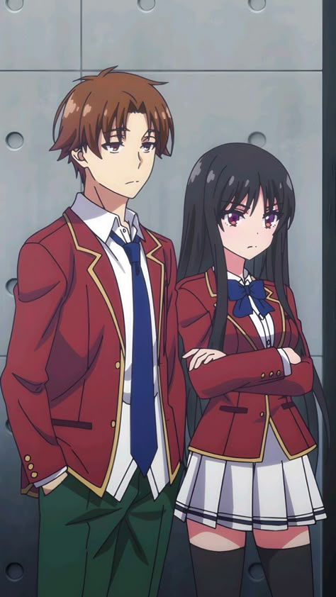
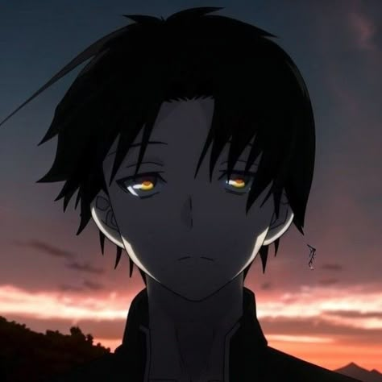
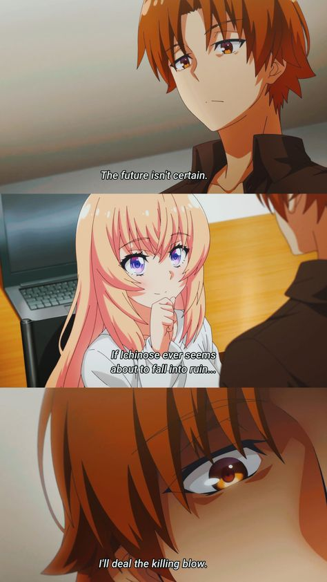
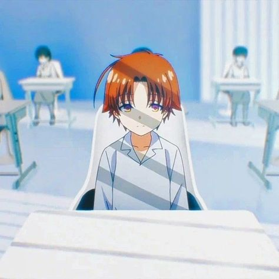
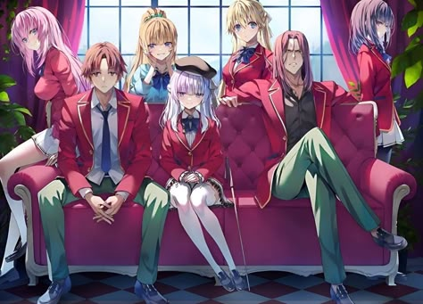
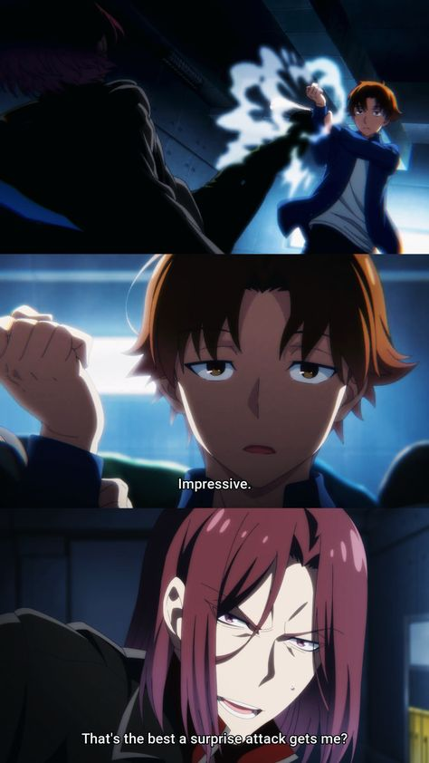
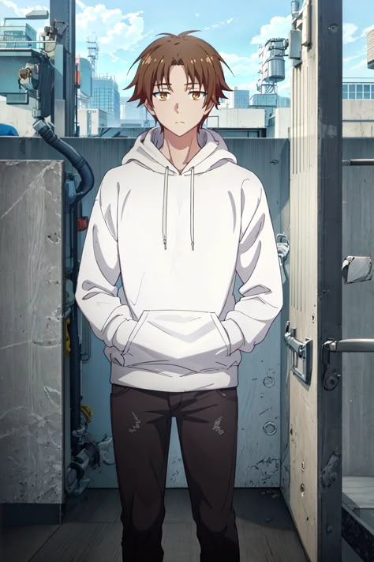

# The classroom of the elite
Status: Ongoing
Category: Psysology, Realistic, Schooltime, Seria🎬
Point: 10
Date: February 13, 2025
Link: https://www.anilibria.tv/release/youkoso-jitsuryoku-shijou-shugi-no-kyoushitsu-e.html

> Старшая школа имени Кёдо Икусей - ведущая престижная школа с самыми высокими показателями, из которой практически 100% выпускников поступают в университеты или находят работу. Учащимся разрешается ходить с любыми прическами и приносить из личных вещей в школу всё, что они пожелают. Кёдо Икусей - райская школа, но правда в том, что так обращаются только с лучшими. Киотака Аянокеджи - ученик D класса, куда школа "сбрасывает" учеников с низкими результатами. По непонятной причине Киотака был небрежен на вступительном экзамене, поэтому попал туда. После встречи с Сузуне Хорикитой и Кикуо Кушидой, двумя его одноклассницами, его положение начинает меняться.
> 

