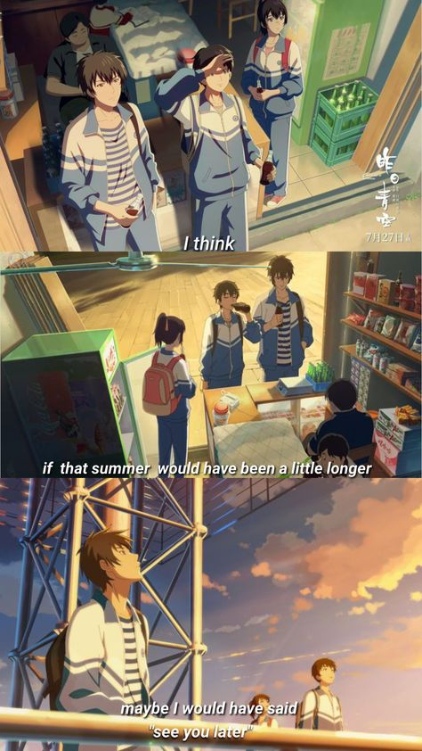
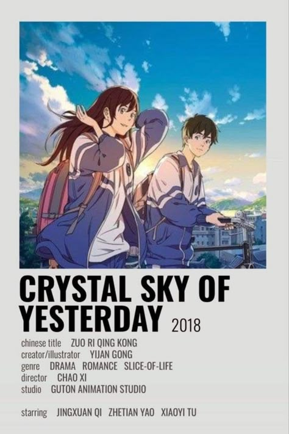
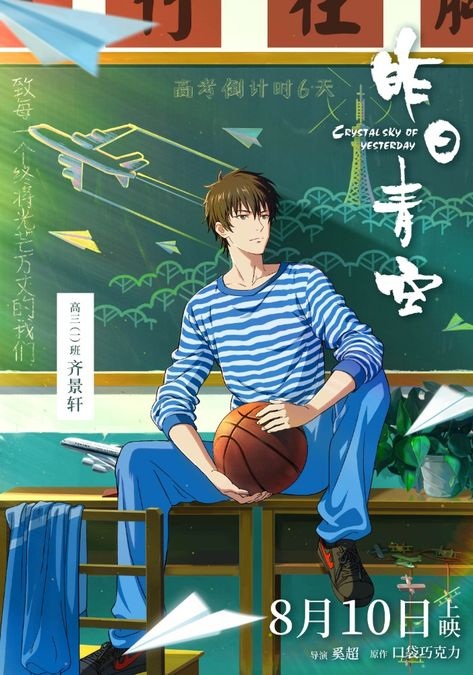
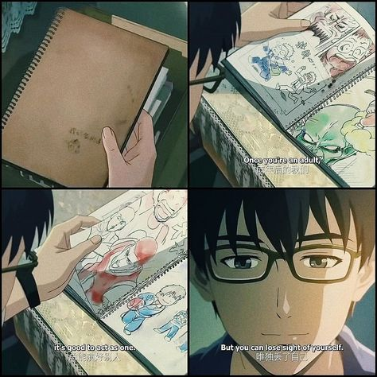

# Хрустальное облака вчерашнего дня

Status: Watched ✨
Category: Donxua, Film, Loyalty, Melancholia, Realistic, Romantic, Sadness, Schooltime, Sport, Vibe
Point: 10
Date: February 15, 2025 → February 15, 2025
Link: https://uzmovi.tv/multfilmlari/6823-kechagi-bulutlar-osmoni.html

> Успешный иллюстратор Ван, погрузился в воспоминания о юности. Будучи 
старшеклассником, Ван абсолютно ничего не хотел делать. Его не 
интересовало будущее. Единственное, чем он увлекался - это рисованием и 
игрой в видеоигры. На выполнение школьных уроков он совсем не тратил 
времени. Юный ученик знал, что карьера художника ему не светит, ведь для
 поступления в художественную академию нужны проходные баллы. Но из-за 
того, что он не интересовался учебой, этих баллов ему ни набрать. 
Поэтому Ван и не переживал. Но все кардинально поменялось, когда учитель
 попросил Вана помочь отличнице Юи.
> 
> 
> Юи была очень красивая и 
> милая девушка. Она старательно выполняла все, за что брались ее умелые 
> ручки и пытливый мозг. Но единственное, что у нее не получалось – это 
> рисовать. Задача Вана – помочь отличнице освоить художественное 
> искусство и выиграть в конкурсе художников. Ежедневные занятия с 
> одноклассницей зародили глубоко в душе главного героя теплые чувства. Он
>  заметил, что влюбляется в одноклассницу. Чтобы покорить ее сердце, 
> парень начинает заниматься науками. Ему предстоит сильно постараться, 
> чтобы удержать Юи рядом, ведь девушка приглянулась уверенному красавчику
>  Ли.
> 
> 
> 

[https://youtu.be/B4yHBuGJEZ4?si=5-SnjvRg3oQsoCKr](https://youtu.be/B4yHBuGJEZ4?si=5-SnjvRg3oQsoCKr)

